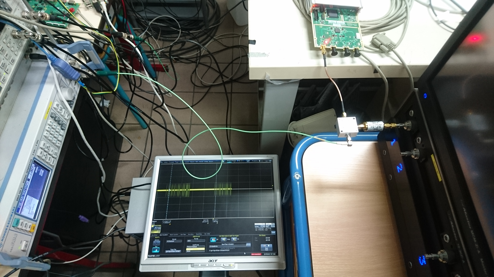

Dataset: the huge initial file

``
512016388 ../../challenge_record_phase_off3p85MHz_10MSps.bin
``

was split in smaller files to make github happier although I was unable to
get the LFS (Large File Storage) to work on the forked repository. The original
file is reconstructed with

``
cat *bin > challenge_record_phase_off3p85MHz_10MSps.bin
``

although the file provided in the initial challenge did not include the hint
about the frequency offset in its name.

The dataset was collected at a sampling rate of 10 MS/s using a Lecroy radiofrequency-grade
oscilloscope as can be seen on the picture below: the signal generated by the GNU/Octave script
found in ../setup was played with a B210 and frequency transposed with a mixer to reach
a carrier frequency below 5 MHz.

